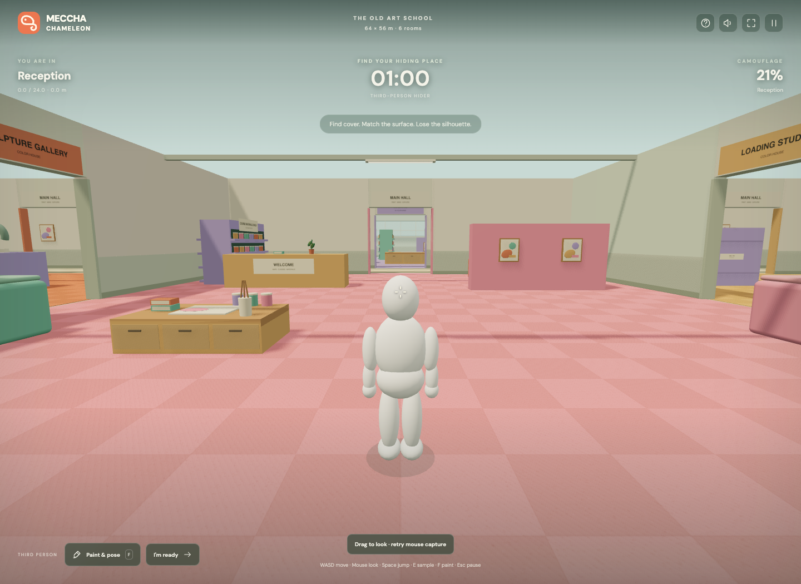
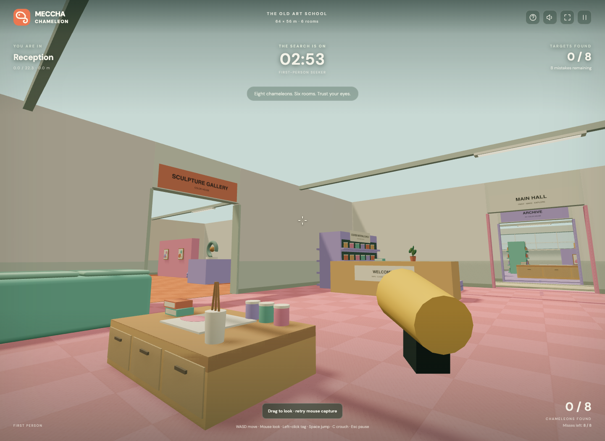

# Meccha Chameleon — The Old Art School

A playable single-player browser adaptation of [Meccha Chameleon](https://store.steampowered.com/app/4704690/MECCHA_CHAMELEON/), with first-person seeking, third-person hiding, mouse-look, and WASD movement through a large 3D environment. Built with TypeScript, Three.js, and Vite. All maps, mannequins, materials, icons, and sound effects are created in code. This independent fan project is unaffiliated with the original developer.





## Run

Use Node.js 24 or newer.

```sh
npm ci
npm run dev
```

Open the URL printed by Vite. WebGL and browser graphics acceleration are required. Fonts are bundled locally; gameplay does not call external services.

```sh
npm run build
npm run preview
```

Production files are written to `dist/`. Serve that directory with a static web host.

## Play

Choose your role, then enter the school. The game requests mouse capture so moving the mouse turns the camera continuously. Press Escape to pause and release it. Browsers that restrict mouse capture support dragging the room to look instead.

- **Hide:** your mannequin is visible through a third-person camera that follows you and stops against walls. You have 60 seconds to explore, paint, and find cover, followed by a two-minute search by three computer-controlled seekers. Matching a surface, reducing your silhouette, staying still, and breaking sightlines all matter. Matching colors does not make you invincible during a close inspection.
- **Seek:** walk through the school in first person. Aim the center crosshair and left-click to tag a visible chameleon within 14 meters. Find all eight in three minutes. Eight misses end the round. Walls and furniture block shots, and targets are distributed across every room.
- **Paint:** press F to open your color and pose panel. Aim at a nearby surface and press E to sample its actual color, or choose a palette/custom color and pattern. Opening the paint panel releases the mouse; the round clock continues. Close it to resume movement.

The map measures **64 × 56 meters**, approximately 30 times the original prototype's floor area. It contains Paint Workshop, Archive, Greenhouse, Sculpture Gallery, Reception, and Loading Studio, connected by real doorways and a central hall. Shelving, partitions, workbenches, crates, and planters provide cover. Room signs and colored floors help you navigate. Walls remain opaque from every camera angle. Targets start far from the entrance in covered locations, and their positions vary between rounds.

| Input             | Action                                            |
| ----------------- | ------------------------------------------------- |
| WASD / arrow keys | Move and strafe relative to your view             |
| Mouse             | Look around; drag if mouse capture is unavailable |
| Space             | Jump onto low props                               |
| C / Ctrl          | Toggle crouching                                  |
| F                 | Open/close the hider's paint panel                |
| E                 | Sample a nearby surface under the crosshair       |
| R                 | Cycle hider poses: stand, crouch, flatten         |
| Mouse wheel       | Adjust third-person camera distance               |
| Left mouse button | Tag at the crosshair in seeker mode               |
| Escape            | Pause and release the mouse                       |

Touch screens have movement, jump, and tag buttons; drag the room to look. Opening instructions or switching away pauses gameplay. Scores and sound preference are stored in this browser. This version has AI opponents; online multiplayer and freehand body painting are not implemented.

## Verify

```sh
npm test
npm run build
npx playwright install chromium
npm run test:e2e
```

`npm run check` runs formatting, model/camera tests, the production build, and browser tests. Tests cover both cameras, wall clipping, view-relative movement, jumping and landing, doorway navigation, height-aware sight, randomized covered targets, round transitions, scoring, pointer lock/fallback, crosshair input, pause behavior, and touch controls. Browser tests use port 4177 and write screenshots under ignored `test-results/`.

## Structure

- `src/map.ts`: shared room bounds, collision geometry, surface colors, hiding spots, and patrol points.
- `src/game.ts`: deterministic gameplay, movement physics, collision, tagging, and seeker AI.
- `src/camera.ts`: eye-level first person and collision-aware third-person camera calculations.
- `src/world.ts`: the procedural environment, mannequins, materials, and animation.
- `src/main.ts`: mouse capture, keyboard/touch input, rendering, sound, and game interface.
- `src/style.css`: full-viewport game UI and responsive controls.
- `tests/`: model, camera, and browser checks.

Rendering, player collision, AI navigation, and visibility use the same map geometry. The model accepts a seeded random source for reproducible tests. No backend, account, telemetry, or API key is needed.
