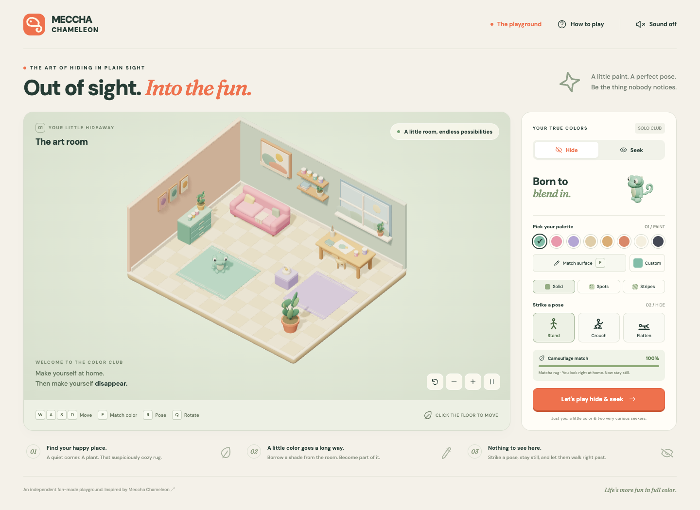

# Meccha Chameleon — The Color Club

A playable browser adaptation of the paint-and-hide loop from [Meccha Chameleon](https://store.steampowered.com/app/4704690/MECCHA_CHAMELEON/), built with TypeScript, Three.js, and Vite. All room geometry, characters, patterns, icons, and sound effects are created in code. This is an independent fan project, unaffiliated with the original developer.



## Run

Use Node.js 24 or newer.

```sh
npm ci
npm run dev
```

Open the local URL printed by Vite. WebGL and browser graphics acceleration are required. Fonts are bundled locally; gameplay does not call external services.

```sh
npm run build
npm run preview
```

The production files are written to `dist/`. Serve that directory with a static web host.

## Play

- **Hide:** customize your chameleon, then start a round. You have 25 seconds to find a spot and match a surface. Survive two computer-controlled seekers for 45 seconds. Matching color, crouching or flattening, furniture cover, and staying still reduce detection. You can skip preparation when ready.
- **Seek:** find five randomly placed, camouflaged chameleons in 60 seconds. Click a visible chameleon to tag it. Five mistakes end the round. Rotate the camera to look behind furniture.
- **Paint:** choose a palette or custom color, then use solid, spotted, or striped paint. Your selected color, pattern, and pose carry into the round.
- **Replay:** results show your score and browser-local personal best. Replay either role. Sound is optional and synthesized locally.

| Input             | Action                                        |
| ----------------- | --------------------------------------------- |
| WASD / arrow keys | Move relative to the camera                   |
| Click the floor   | Move toward a spot; furniture blocks the path |
| E / Match surface | Sample the nearby rug, furniture, or floor    |
| R / pose buttons  | Cycle standing, crouched, and flat poses      |
| Q / rotate button | Rotate the room                               |
| Zoom buttons      | Zoom in or out                                |
| Escape / pause    | Pause and resume                              |
| Click a chameleon | Tag it in seeker mode                         |

Touch devices have movement buttons, painting controls, and tap-to-move/tag. Opening instructions, switching tabs, and losing window focus pause gameplay. This version is single-player; online lobbies, multiplayer, freehand body painting, and the original game's maps are outside its scope.

## Verify

```sh
npm test
npm run build
npx playwright install chromium
npm run test:e2e
```

`npm run check` runs all three checks. Model tests cover round transitions, detection, collision, surface matching, scoring, valid randomized targets, and terminal state behavior. Browser tests cover rendering, painting, role selection, pause/resume, instructions, and responsive layout. The browser suite runs its own Vite server on port 4177.

## Structure

- `src/game.ts`: deterministic gameplay model, collisions, surfaces, and seeker AI.
- `src/world.ts`: procedural studio, characters, materials, and animation.
- `src/main.ts`: browser controls, rendering, sound, and round UI.
- `src/style.css`: responsive visual design and accessibility states.
- `tests/`: gameplay and browser checks.

The model has no rendering dependencies and accepts a seeded random source for reproducible tests. No backend, account, telemetry, or API key is needed.
